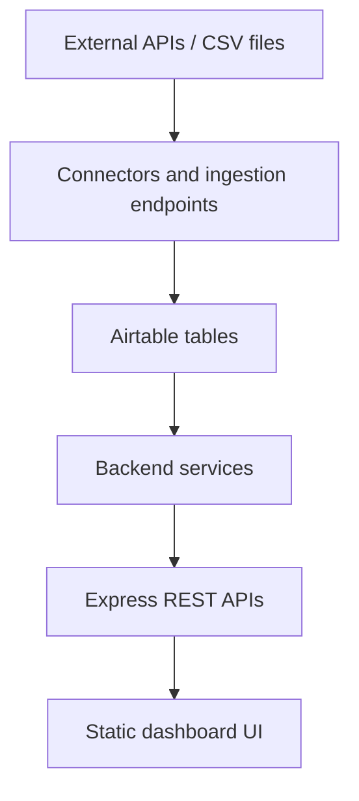
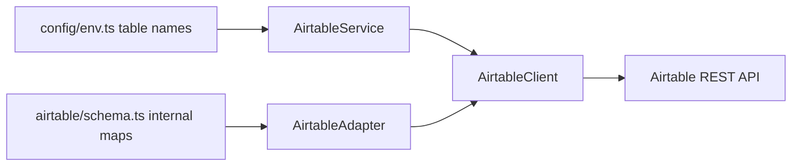
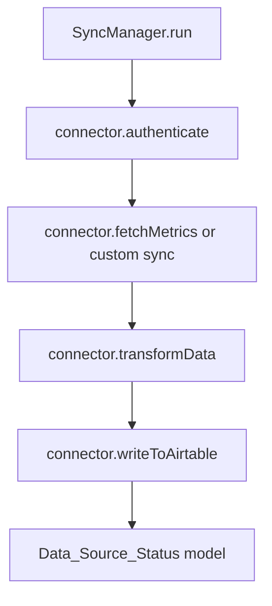
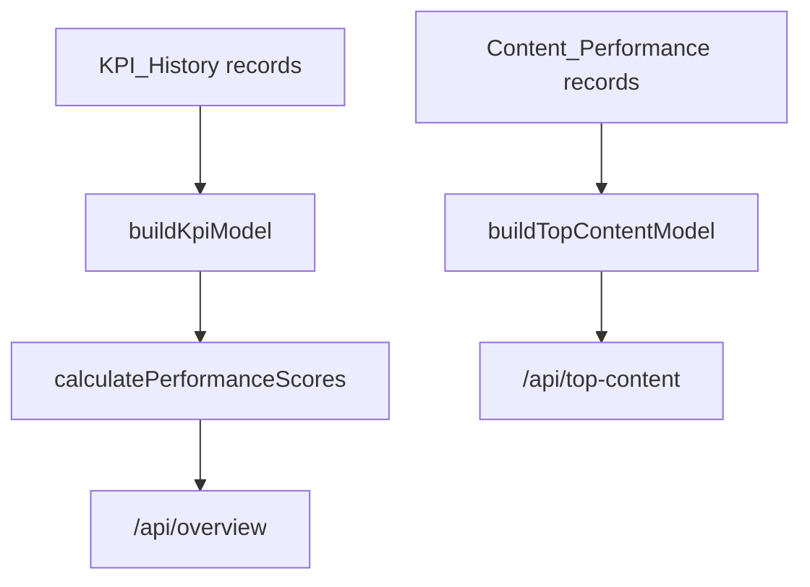

# Architecture

> Generated by `npm run snapshot` on 2026-07-20T14:00:11.192Z. This snapshot is derived from repository files and does not include secret values.

## Data Flow

## Backend Architecture

- `createApp()` wires Airtable, services, connectors, routes, static assets, and error handling.
- `AirtableClient` performs paginated Airtable REST reads/writes.
- `AirtableAdapter` translates internal field names into Airtable columns and skips unavailable mapped fields.
- `AirtableService` provides cached reads by table key.
- `CommunicationsAnalyticsService` assembles dashboard responses.
- `DashboardAggregationService` combines non-Spotify channel analytics.
- `kpiCalculationEngine` owns score formulas.
- `communicationsIntelligenceModel` builds overview, content, comparison, and score models.

## Frontend Architecture

Current frontend code is static JavaScript in `apps/backend/public/app.js`. It implements page routing, API calls, filters, charts, cards, and tables without React.

## Airtable Interaction

## Connector Pattern

## KPI Calculation Flow

## Request Lifecycle

1. Express receives a request in `app.ts`.
2. Optional auth checks run for sync endpoints.
3. A service fetches Airtable data through `AirtableService` or writes through `AirtableAdapter`.
4. Service logic normalizes and aggregates records.
5. The route returns JSON consumed by `apps/backend/public/app.js`.
