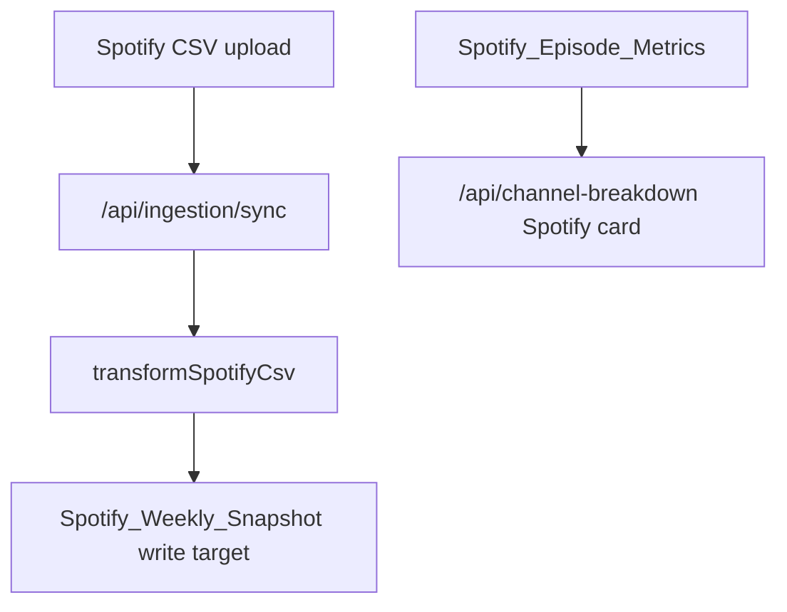

# Project Snapshot Audit

> Reviewed on 2026-07-20. This audit compares the generated `project-snapshot/` markdown files against the current repository implementation. The snapshot was not regenerated during this audit, and no application code was changed.

## Verification Scope

Reviewed snapshot files:

- `README.md`
- `folder-structure.md`
- `architecture.md`
- `backend-services.md`
- `connectors.md`
- `api-routes.md`
- `frontend.md`
- `airtable.md`
- `environment.md`
- `integrations.md`
- `technical-debt.md`
- `development-roadmap.md`
- `dependency-graph.md`

Implementation files checked included:

- `apps/backend/src/app.ts`
- `apps/backend/src/config/env.ts`
- `apps/backend/src/airtable/schema.ts`
- `apps/backend/src/airtable/adapter.ts`
- `apps/backend/src/types/airtableTables.ts`
- `apps/backend/src/services/*`
- `apps/backend/src/services/platformAnalytics/*`
- `apps/backend/src/connectors/*`
- `apps/backend/src/ingestion/*`
- `apps/backend/public/app.js`
- `apps/backend/public/index.html`
- `package.json`
- `render.yaml`

## Correct Items

- The high-level description is correct: the repository currently implements a Node.js, TypeScript, Express backend with Airtable as the data store and a backend-served static dashboard.
- The snapshot correctly states that there is no React application in the current implementation. `apps/dashboard` exists but contains no files, and the active UI lives in `apps/backend/public`.
- The frontend pages documented in `frontend.md` match the active page registry in `apps/backend/public/app.js`: KPI Overview, Top Performing Content, and Channel Breakdown.
- The navigation labels documented in `frontend.md` match `apps/backend/public/index.html`.
- The main frontend API calls documented in `frontend.md` are correct: `/api/overview`, `/api/status`, `/api/top-content`, and `/api/channel-breakdown`.
- The Express route list in `api-routes.md` matches the route registrations and route arrays in `apps/backend/src/app.ts`.
- The Airtable table keys, default table names, and TypeScript interfaces in `airtable.md` match `apps/backend/src/config/env.ts`, `apps/backend/src/airtable/schema.ts`, and `apps/backend/src/types/airtableTables.ts`.
- The snapshot correctly identifies `Spotify_Episode_Metrics` as the source currently used by the Spotify Channel Breakdown logic.
- The snapshot correctly identifies the Spotify ingestion mismatch: the current ingestion transformer and `SpotifyConnector` still target `spotifyWeeklySnapshot`, while Channel Breakdown reads `spotifyEpisodeMetrics`.
- The snapshot correctly states that `Channel_Performance` is retained for compatibility/debugging and that Spotify should not depend on it.
- The snapshot correctly identifies `MailchimpService` as the live Mailchimp API integration and `MailchimpConnector` as a mock connector in the connector framework.
- The connector table correctly identifies the implemented connector classes and their modes for Mailchimp, Castos, YouTube, Website, and Spotify.
- `technical-debt.md` accurately calls out the major current architecture tensions: static frontend versus React goal, split integration patterns, Spotify table mismatch, stale older docs, and empty `apps/dashboard`.
- `development-roadmap.md` is directionally aligned with the current repo state and prioritizes the right next work.
- The dependency diagrams are broadly correct at the system level.
- No secret values are exposed in the generated snapshot.
- The `npm run snapshot` command exists in `package.json`, and `scripts/generate-project-snapshot.mjs` writes only documentation files under `project-snapshot/`.

## Incorrect Items

- `environment.md` marks `AIRTABLE_PAT` as simply `Required`, but the implementation accepts either `AIRTABLE_PAT` or `AIRTABLE_API_KEY`. More precise wording would be: required unless `AIRTABLE_API_KEY` is set.
- `environment.md` marks `AIRTABLE_API_KEY` as `Optional/defaulted`. It is optional, but not defaulted; it is an alternate Airtable credential fallback.
- `environment.md` marks `MAILCHIMP_API_KEY`, `MAILCHIMP_SERVER_PREFIX`, and `MAILCHIMP_AUDIENCE_ID` as `Optional/defaulted`. They are optional for app startup, but all three are required for `MailchimpService` to report `configured: true`.
- `backend-services.md` incorrectly lists many connector files as consumers of `apps/backend/src/services/platformAnalytics/types.ts`. This appears to be a generator false positive caused by matching the generic filename `types.js`; those connector files import `apps/backend/src/connectors/types.ts`, not `platformAnalytics/types.ts`.
- `architecture.md` shows a single connector flow where `SyncManager.run` calls `authenticate`, `fetchMetrics`, `transformData`, and `writeToAirtable`. That is accurate for `BaseConnector`-based mock connectors, but not for `SpotifyConnector`, which overrides `sync()` and uses a custom payload/write path.
- `technical-debt.md` says stale documents are in `docs/`, but the root `README.md` also contains stale source-table language. For example, it still says primary pages use `Spotify_Weekly_Snapshot` and `Channel_Performance`, while current source uses `Spotify_Episode_Metrics` for Spotify Channel Breakdown and non-Spotify platform services read `Content_Performance` plus `KPI_History`.
- `dependency-graph.md` shows `Spotify CSV -> /api/ingestion/sync -> Airtable -> dashboard` without showing that ingestion currently writes weekly snapshot records while the dashboard reads episode metrics. The graph is directionally correct, but it hides the most important Spotify mismatch.

## Missing Documentation

- The snapshot does not document the current Spotify ingestion payload shape in enough detail. Current code uses `SpotifyIngestionPayload` with `snapshots`, not `episodes`, and maps CSV columns to `spotifyWeeklySnapshot` internal fields.
- `api-routes.md` should document `/api/ingestion/sync` more precisely:
  - multipart uploads can provide `connectorId` in the request body
  - raw CSV uploads must provide `connectorId` in the query string
  - `dryRun` defaults to `true`
  - production requests require `SYNC_API_KEY` bearer auth when configured
- `api-routes.md` gives broad response shapes for dashboard routes but does not document response shapes for ingestion, Mailchimp, data-health, debug, legacy sync, or Airtable proxy routes.
- `backend-services.md` documents files under `apps/backend/src/services`, but omits important backend layers that behave like services:
  - `AirtableClient`
  - `AirtableAdapter`
  - CSV parser and Spotify transformer modules
  - connector registry and base connector framework
  - error handling and logger modules
- `backend-services.md` lists exported methods and dependencies, but it does not provide per-service purpose and responsibilities for every service as requested.
- `folder-structure.md` does not include the deeper ingestion files under `apps/backend/src/ingestion/csv` and `apps/backend/src/ingestion/spotify` in the tree, even though those files are important to the current Spotify pipeline.
- `folder-structure.md` does not explicitly note that `apps/backend/src/server/` is an empty directory alongside `apps/backend/src/server.ts`.
- `frontend.md` should document that `/comparative` is a static frontend route alias that maps to the Channel Breakdown page in `pageFromPath()`, not a separate visible navigation page.
- `frontend.md` should document the date-range selector behavior and query string construction for KPI Overview and Channel Breakdown.
- `airtable.md` should distinguish between tables used for reads, tables used for writes, and tables used only for diagnostics/legacy compatibility.
- `airtable.md` should document startup schema validation behavior: `AirtableAdapter.validateMappedSchemaOnStartup()` marks unavailable mapped fields and later skips them during writes.
- `airtable.md` should document that `DataHealthService` still checks `Spotify_Weekly_Snapshot` and `Channel_Performance`, even though they are not the primary Spotify dashboard source.
- `environment.md` should document the custom env-file load order from `loadEnvFiles()`: repo `.env`, backend `.env`, current working directory `.env`, plus `.env.local` variants.
- `environment.md` should call out that `render.yaml` does not explicitly include every table override now supported by `env.ts`; some newer tables rely on code defaults unless configured manually in Render.
- `integrations.md` should document that `SyncManager` persists `Data_Source_Status` only when `dryRun` is `false`; otherwise status/history remain in memory.
- `integrations.md` should document the difference between live `MailchimpService` endpoints and mock `MailchimpConnector` ingestion framework behavior.
- `technical-debt.md` should explicitly note that there are no automated tests visible in the current repo for route contracts, Airtable mapping, connector transforms, or KPI calculations.
- `dependency-graph.md` should include `DataHealthService`, `MailchimpService -> AirtableAdapter`, `platformAnalytics services -> AirtableService`, and `AirtableService -> AirtableClient` edges.

## Documentation That Should Be Removed

- `connectors.md` should remove framework/helper modules from the platform connector table:
  - `apps/backend/src/connectors/base.ts`
  - `apps/backend/src/connectors/baseConnector.ts`
  - `apps/backend/src/connectors/index.ts`
  - `apps/backend/src/connectors/registry.ts`
  - `apps/backend/src/connectors/types.ts`

  These should be documented in a separate "Connector Framework" section instead of appearing as platform connectors with `n/a` metadata.

- `folder-structure.md` should avoid listing local `.env` and `apps/backend/.env` files in the main repository tree. The docs can mention local env files in `environment.md` without making them look like normal project artifacts.
- Older non-snapshot docs and the root `README.md` should remove or update claims that primary dashboard pages still use `Spotify_Weekly_Snapshot` or `Channel_Performance` as primary sources. Those claims are no longer accurate for the current Channel Breakdown implementation.

## Suggested Improvements

- Update the snapshot generator so service consumer detection resolves relative import paths instead of matching only a basename like `types.js`. This would prevent false consumer references for `platformAnalytics/types.ts`.
- Add a source-derived "Route Details" section that extracts or documents auth, query params, body formats, and response examples per route.
- Split backend documentation into these sections:
  - Express app and routes
  - Airtable boundary
  - dashboard analytics services
  - platform analytics services
  - ingestion framework
  - connector framework
  - legacy KPI sync foundation
- Add a table-level Airtable matrix with columns for read source, write target, diagnostics only, legacy, and primary dashboard use.
- Add a "Current Spotify Pipeline" diagram that explicitly shows the mismatch:

- Add a "Current Dashboard Data Sources" table:
  - KPI Overview: `KPI_History`, `Data_Source_Status`, `Spotify_Episode_Metrics`, `Content_Performance`, `Monthly_Activity_Summary`
  - Top Performing Content: `Content_Performance`
  - Channel Breakdown: `Spotify_Episode_Metrics` for Spotify; `Content_Performance` and `KPI_History` through platform analytics services for Email, Social, Website, Voice of Elim, and Elim Updates; future placeholders for Castos and YouTube
- Add a "Known Stale Docs" index covering `README.md` and files under `docs/`.
- Add a "Testing Status" section that explicitly states no test suite was found and identifies the highest-value test targets.
- Add a "Generated Snapshot Limitations" note explaining that the snapshot generator uses regex-based extraction and may need manual review for imports, route behavior, and response shapes.

## Summary

The generated snapshot is useful and mostly accurate as a current-state orientation document. The most important corrections are not about the core architecture; they are about precision:

- improve environment variable required/optional wording
- fix false-positive service consumers
- document `/api/ingestion/sync` behavior more deeply
- separate connector framework files from actual platform connectors
- make the Spotify ingestion-versus-dashboard table mismatch visible in the dependency graph
- update stale root and historical docs that still describe older table dependencies
