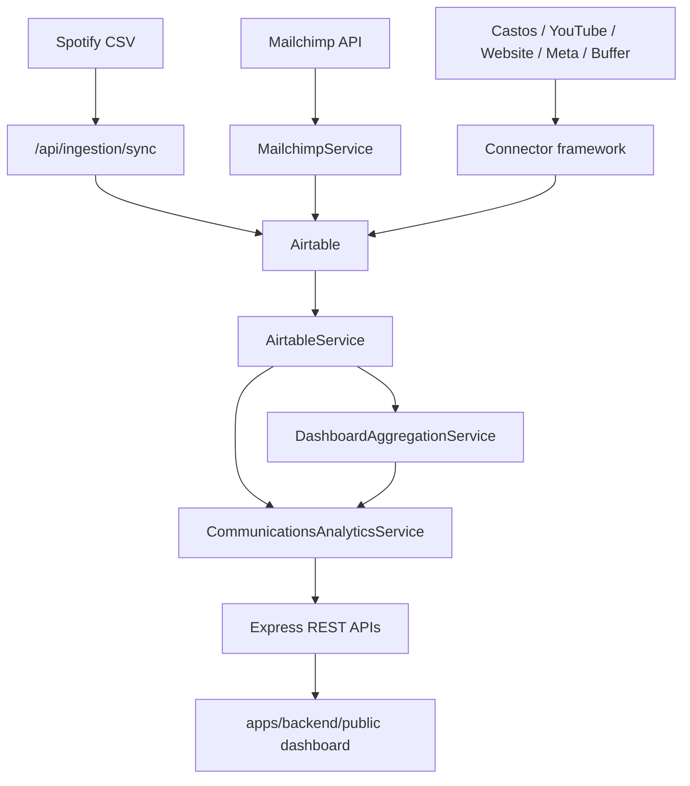
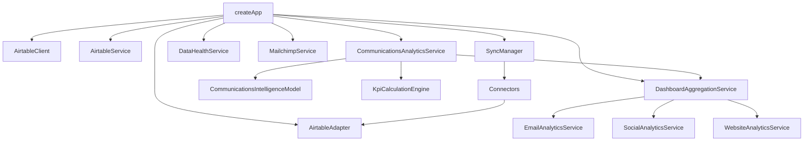

# Dependency Graph

> Generated by `npm run snapshot` on 2026-07-20T14:00:11.192Z. This snapshot is derived from repository files and does not include secret values.

## System Dependency Graph

## Service Dependency Graph

