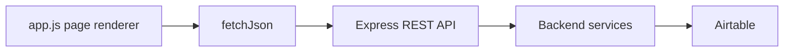

# Frontend

> Generated by `npm run snapshot` on 2026-07-20T14:00:11.192Z. This snapshot is derived from repository files and does not include secret values.

## Current Implementation

The current UI is not a React app. It is static HTML/CSS/JavaScript served by the backend:

- `apps/backend/public/index.html`
- `apps/backend/public/app.js`
- `apps/backend/public/styles.css`

`apps/dashboard` exists but is empty.

## Pages

| Key | Title | Path | Backend APIs |
| --- | --- | --- | --- |
| overview | KPI Overview | / | /api/overview /api/status |
| content | Top Performing Content | /top-performing-content | /api/top-content |
| channel-breakdown | Channel Breakdown | /channel-breakdown | /api/channel-breakdown |

## Navigation

| Data Page | Label |
| --- | --- |
| overview | KPI Overview |
| content | Top Performing Content |
| channel-breakdown | Channel Breakdown |

## API Usage

- `/api/channel-breakdown`
- `/api/overview`
- `/api/status`
- `/api/top-content`

## Data Flow Into UI

## React Gap

The project goal mentions a React dashboard, but the current codebase has no React dependencies, components, hooks, JSX/TSX files, or frontend build script.
